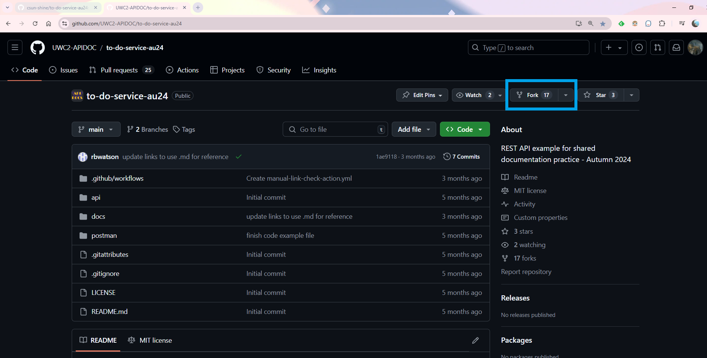
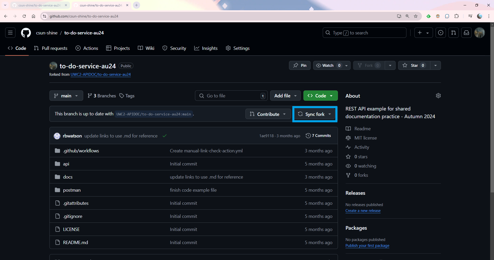

# Tutorial: Before you start

In this tutorial, you will learn how to set up the To-Do Service development environment.
You must complete these steps before you can run any of the other tutorials for the **To-Do Service**.
You only have to do this one time per development system.

In this tutorial you will learn how to:

<!-- no toc -->
    * [Step 1: Create a GitHub account](#step-1-create-a-github-account)
    * [Step 2: Download, intall, and configure Git on your computer](#step-2-download-intall-and-configure-git-on-your-computer)
    * [Step 3: Download GitHub desktop (optional)](#step-3-download-github-desktop-optional)
    * [Step 4: Fork the To-Do Service repo](#step-4-fork-the-to-do-service-repo)
    * [Step 5: Authenticating with GitHub from Git](#step-5-authenticating-with-github-from-git)
    * [Step 6: Install node.js and the json-server](#step-6-install-nodejs-and-the-json-server)
    * [Step 7: Syncing fork](#step-7-syncing-fork)
    * [Step 8: Download Postman](#step-8-download-postman)
    * [Step 9: Test your development system](#step-9-test-your-development-system)

Expect this tutorial to take about 20 minutes to complete.

## Before you begin

To complete the tuotorial, you need a development system (PC, Mac, or Linux) running a current or
long-term support (LTS version of the operating system).

## Step 1: Create a GitHub account

The first step to setting up your Git environment is to create a [GitHub](https://github.com)
account. You can use an existing GitHub account if you already have one or create a new one by
going to the GitHub website linked above.

## Step 2: Download, intall, and configure Git on your computer

The To-Do Service requires using Git on the command line and so [Git](https://git-scm.com/downloads)
needs to be downloaded, installed, and configured on your computer.

Once Git is donwloaded to your computer, set your username in Git by following [this](https://docs.github.com/en/get-started/getting-started-with-git/setting-your-username-in-git)
tutorial.

Once your username is set, setup your commit email address in Git by following [this](https://docs.github.com/en/account-and-profile/setting-up-and-managing-your-personal-account-on-github/managing-email-preferences/setting-your-commit-email-address)
tutorial.

## Step 3: Download GitHub desktop (optional)

If you would like, you can download [GitHub Desktop](https://desktop.github.com), but it is not required.
GitHub desktop allows you to work with Git locally without using the command line.

## Step 4: Fork the To-Do Service repo

The following steps explain how to fork the To-Do Service repo.

1. Sign in to your GitHub account.
2. Navigate to the [To-Do Service repo](https://github.com/UWC2-APIDOC/to-do-service-au24).
3. In the upper right hand corner of the page, click **Fork**.

    

4. Select the owner of the forked repo under the "Owner" dropdown menu.
5. If you wish to rename the forked repo, type a name into the "Repository name" field.
Otherwise, the forked repo will be named after its upstream repo by default.
6. Click **Create fork**.

If you would like more information on forking repos as well as information on how to clone forked repos,
refer to [this](https://docs.github.com/en/pull-requests/collaborating-with-pull-requests/working-with-forks/fork-a-repo) tutorial.

## Step 5: Authenticating with GitHub from Git

In order to connet to a GitHub repository from Git, you will need to authenticate with GitHub.
Follow the steps in [this](https://docs.github.com/en/get-started/getting-started-with-git/set-up-git#authenticating-with-github-from-git) tutorial to do so.

## Step 6: Install node.js and the json-server

Download and install the LTS version of **node.js** [here](https://nodejs.org/en/download/prebuilt-installer).
Make sure you select the latest LTS version from the dropdown menu to download. Select the relevant OS. Accept all default options.
Follow the steps below to test if your download was successful.

1. Open a commmand line window.
2. Run the `node -v` command.
3. If a version number is returned (e.g., v22.11.0), then node.js was sucessfully installed.

Once **node.js** has been installed, follow the steps below to install the **json-server** package.

1. Open a command line window.
2. Run the `npm install json-server` command.

Once packages are installed, test the command line.

1. Run the `json-server --help` command.
2. If you see the help display for the **json-server**, then the **json-server** was successfully installed.

More information regarding the json-server can be found [here](https://www.npmjs.com/package/json-server)

## Step 7: Syncing fork

Before beginning any work, make sure that your fork is in sync with the original repo. To do so, follow the steps below.

1. Navigate to your forked repo on GitHub.
2. In the upper right hand corner of the main dashboard, click **Sync fork**.



**TIP**: If you're using a fork of the repo, create a working branch in which to do your tutorials. Create a new branch for each tutorial to prevent a mistake in one from affecting your work in another.

## Step 8: Download Postman

Download the [Postman](https://www.postman.com/downloads/) desktop app.
Because you run the **To-Do Service** on your development system with an `http://localhost` hostname,
the web-version of Postman can't perform the exercises.

## Step 9: Test your development system

To test your development system:.

1. Create and checkout a test branch of your fork of the To-Do Service repo. Your `GitHub repo workspace` is the directory that contains your fork of the `to-do-service-au24` repo.

        ```shell
        cd <your GitHub repo workspace>
        ls
        # (see the to-do-service directory in the list)
        cd to-do-service-au24
        git checkout -b tutorial-test
        cd api
        json-server -w to-do-db-source.json
        ```

    If your development system is installed correctly, you should see
    the service start and display the URL of the service: `http://localhost:3000`.

2. Make a test call to the service.

        ```shell
        curl http://localhost:3000/users
        ```

3. If the service is running correctly, you should see a list of users from the service, such as in this example.

        ```js
        [
            {
                "last_name": "Smith",
                "first_name": "Ferdinand",
                "email": "f.smith@example.com",
                "id": 1
            },
            {
                "last_name": "Jones",
                "first_name": "Jill",
                "email": "j.jones@example.com",
                "id": 2
            },
            ...
        ```

If you see the list of users from the service, you have successfully set up your development environment.

## Troubleshooting

If you don't see the list of users, or receive an error in any step
of the procedure, investigate and correct the error before continuing.
Some common situations that cause errors include:

1. You mistyped a command.
2. You aren't in the correct directory.
3. A required software component didn't install correctly.
4. A required software component isn't up to date.

## Next Steps

 Congratulations on setting up your development environment! Below are links to tutorials for some common tasks:

    * [Enroll a new user](enroll-a-new-user.md)
    * [Add a new task](add-a-new-task.md)
